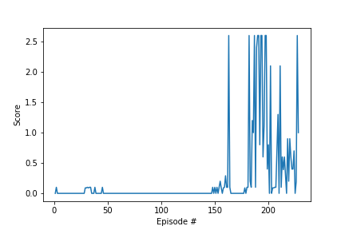

# Udacity DRLND Project 3 Collaboration and Compete

## Learning Algorithm

The Algorithm used in this project is based on the vanila DDPG from the coding exercise. It predicts an action value from the local network based on the env and action that the agent has acted. It also coupled with the vanila experience replay, so the agent can fine the local and target network based on their experience in the memory.

### Model architecture
2 fully connected dense layer with relu as the activation function to predict the Actions for Actor

2 fully connected dense layer with relu as the activation function to predict the value from the Action for the Critic

For each Actor and Critic are coupled with local and target networks

### Hyperparameters
1. Actor: fc1_units=400, activation=relu # Actor Layer 1 neuron size and activation function
1. Actor: fc2_units=300, activation=relu # Actor Layer 2 neuron size and activation function
1. Critic: fc1_units=400, activation=relu # Critic Layer 1 neuron size and activation function
1. Critic: fc2_units=300, activation=relu # Critic Layer 2 neuron size and activation function
1. BUFFER_SIZE = int(1e5) # replay buffer size
1. BATCH_SIZE = 64 # minibatch size
1. GAMMA = 0.99 # discount factor
1. TAU = 1e-3 # for soft update of target parameters
1. LR_ACTOR = 1e-3 # learning rate for Actor
1. LR_CRITIC = 1e-4 # learning rate for Critic
1. WEIGHT_DECAY = 0.0 # L2 weight decay, cant not 

With above hyper parameter setting, the agent was able to achieve good performance and reach score 30 in 19 episodes.

## Plot of Rewards

## Ideas for Future Work
The experience replay in the current model is vanila based which should have improved performance if we only include the important experience as not all memory are equally worthy. Furthermore, algorithms of TRPO and PPO should also be implemented and evaluated in the future work to see how the performance would be different or improved.
